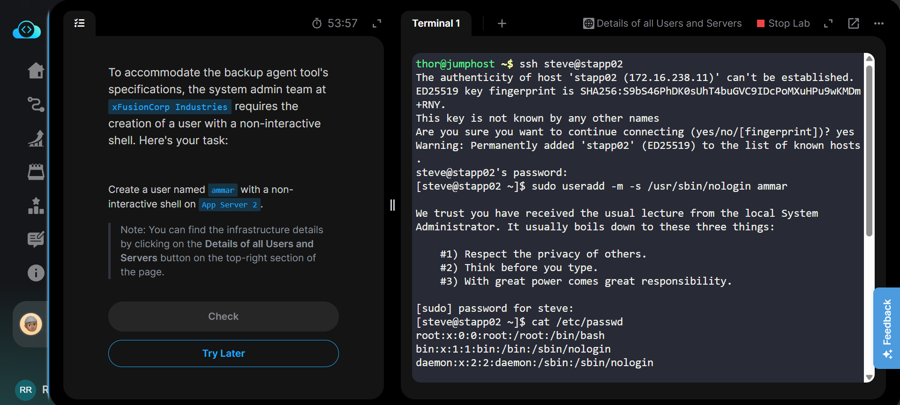
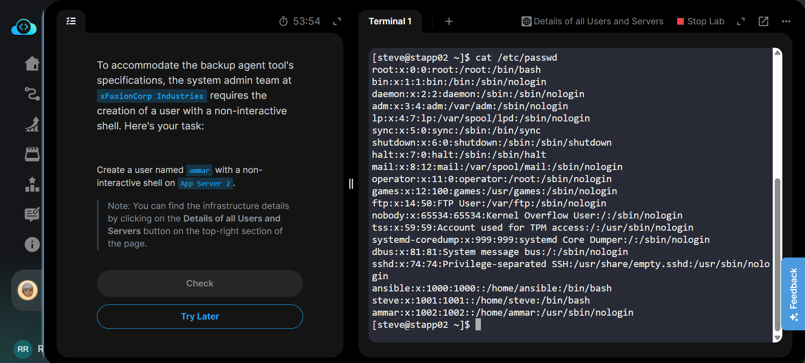
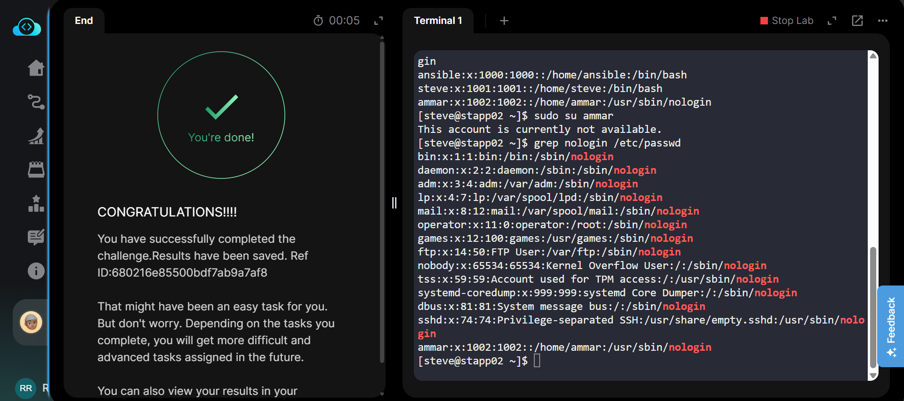

# Day 01: Linux User Setup with Non-interactive Shell

**Difficulty**: 🟢 Beginner | **Time**: 10 minutes | **Category**: Linux Administration

## 📌 Task Summary

Create a user with non-interactive shell for your organization on a specific server. This is essential for service accounts and automated processes that don't require interactive login capabilities.

## 🎯 Objective

- Create a new Linux user
- Assign a non-interactive shell to the user
- Ensure the user cannot log in to the server
- Verify the configuration using standard Linux commands

## 📋 Prerequisites

- Access to a Linux server (CentOS/Ubuntu/RHEL)
- sudo privileges
- Basic understanding of Linux user management

## 🔧 Technologies Used

- Linux user management commands
- SSH access
- System administration

## Steps

1. First, login into the app server using `SSH`:

    ```sh
    ssh user@app-server-ip or ssh user@server-name
    ```

    > It will ask for user password, enter the correct password.

2. After login into server, run the following command to create user with non-interactive shell

    ```sh
    sudo useradd -m -s /usr/sbin/nologin user-name
    ```

    `s`: for shell, here we are giving nologin shell

    `m`: for user home directory, It will create a directory with user-name under /home

3. Verify the result

    ```sh
    cat /etc/passwd
    ```

    It should give you a list of users where you will find your created user. It will look like this:
    `user-name:x:1002:1002::/home/user-name:/usr/sbin/nologin`

    Try to login using:

    ```sh
    sudo su user-name
    ```

    Output: `This account is currently not available.`

### Additional Commands

```bash
# List all users with nologin shell
grep nologin /etc/passwd

# Check user details
id user-name

# Remove user if needed
sudo userdel -r user-name
```

## Key Takeaways

- Non-interactive shells prevent direct user login
- Service accounts should use `/usr/sbin/nologin` or `/bin/false`
- Always verify user creation with multiple methods
- Understanding user shells is crucial for system security

## Good to Know?

### Linux User Management

- **User Types**: Regular users, system users, service accounts
- **Shell Types**: `/bin/bash` (interactive), `/usr/sbin/nologin` (non-interactive), `/bin/false` (deny access)
- **User Database**: `/etc/passwd` stores user information, `/etc/shadow` stores passwords

### useradd Command Options

- `-m`: Create home directory
- `-s`: Specify shell
- `-d`: Custom home directory path
- `-g`: Primary group
- `-G`: Additional groups
- `-e`: Account expiry date

### Security Best Practices

- Service accounts should use non-interactive shells
- Regular users need interactive shells like `/bin/bash`
- Always verify user creation with multiple commands
- Use principle of least privilege

## Screenshots





**Next Challenge**: [Day 02 - Temporary User Setup](./002.md)
